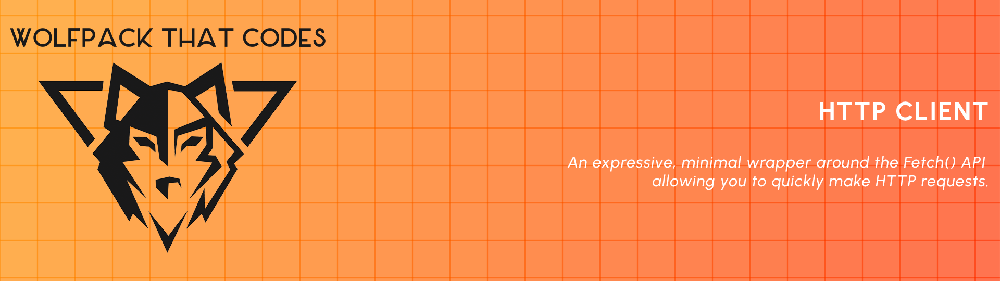

<p align="center">
  <a href="http://github.com/wolfpackthatcodes/vite-typescript-package-toolkit">
    
  </a>
</p>

<h4 align="center">
  Toolkit for creating Vite TypeScript library npm packages.
</h4>

<p align="center">
  <a href="#about">About</a> •
  <a href="#disclaimer">Disclaimer</a> •
  <a href="#getting-started">Getting Started</a> •
  <a href="#how-to-use">How To Use</a>
</p>
<p align="center">
    <a href="#changelog">Changelog</a> •
  <a href="#contributing">Contributing</a> •
  <a href="#security-vulnerabilities">Security Vulnerabilities</a> •
  <a href="#Sponsor">Sponsor</a> •
  <a href="#license">License</a>
</p>

## About

This repository is a GitHub Template for scaffolding a TypeScript library npm package. This repository includes the following:

- Example package code.
- VS Code recommended extensions & settings.
- A Makefile to automate the set-up of the Vite TypeScript package toolkit.
- A Docker Compose file to run Vitest UI to interact with your tests.
- GitHub Actions for pull requests, publishing to npm registry & GitHub Packages.
- GitHub community standards documents and policies.

#### Tech Stack

The tech stack used in this repository:

- Node.js
- Vite
- Vitest
- TypeScript
- ESLint
- Prettier

## Disclaimer

The Docker Compose file included in this repository was configured for local environments. Do not deploy the Docker Compose file in production environments.

## Getting Started

This repository uses [Node.js](https://nodejs.org) and [Yarn](https://yarnpkg.com/) or [Docker](https://www.docker.com/). You will need to make sure your system meets the following prerequisites:

- Node >= 18.0.0
- Docker Engine >= 20.10.00

There are a few ways to start using this repository. You can begin by following any of the steps:

- Press the "_Use this template_" button or follow the steps in the GitHub documentation for [creating a repository from a template](https://docs.github.com/en/github/creating-cloning-and-archiving-repositories/creating-a-repository-from-a-template) for a step-by-step guide.

- Use [degit](https://github.com/Rich-Harris/degit) to execute:

  ```shell
  degit github:wolfpackthatcodes/vite-typescript-package-toolkit
  ```

- Use [GitHub CLI](https://cli.github.com/) to execute:

  ```shell
  gh repo create <name> --template="https://github.com/wolfpackthatcodes/vite-typescript-package-toolkit"
  ```

- Or simply `git clone` this repository, delete the existing .git folder, and then run the following commands:

  ```shell
  git init && git add -A && git commit -m "Initial commit"
  ```

## How To Use

Below, we have outlined the main steps you would need to take to get started.

#### Package code

The package code is located in the `./code` directory. This repository includes a sum function for adding numbers and test examples using Vitest.

#### Installation

You can run the `yarn install` command or use the Makefile `local-setup` target to install your package dependencies.

```shell
$ yarn install

# or

$ make local-setup
```

**Please note:** The Makefile `local-setup` target utilizes Docker.

#### Development

During development, you can link your package to a project. This is often useful to test out new features or when trying to debug an issue. To link your package from within an app:

- **From your package**:  
  Run the `link` command to register the package.

  ```shell
  $ yarn link
  ```

- **From your app**:  
  Run the `link` command to use the package inside your app during development.

  ```shell
  $ yarn link "package-name"
  ```

Once you have completed developing your package, you will need to `unlink` both your library and test app projects.

- **From your app**:  
  Run the `unlink` command to unlink a package that was symlinked during development.

  ```shell
  $ yarn unlink "package-name"
  ```

- **From your package**:  
  Run the `unlink` command to remove the global symbolic link (symlink) for the package.

  ```shell
  $ yarn unlink
  ```

#### Testing

**_Vite Typescript Package Toolkit_** includes Vitest & Vitest UI. You can run the following command to access the Vitest UI.

```shell
$ yarn run test:ui

# or

$ docker compose up
```

Then you can visit the Vitest UI in your web browser at [http://localhost:51204/**vitest**/](http://localhost:51204/__vitest__/).

You can override the variables in the Docker Compose file, e.g. container name, network name and port mapping. This repository includes a DotEnv example file (`.env.example`) that you can copy to create your DotEnv file and override the Docker Compose variables.

#### GitHub Actions

This repository includes Composite Actions and three GitHub Actions:

<details>
<summary><b>Pull Request</b></summary>

The Pull Request workflow only runs when a `pull_request` event's activity type is **opened**, **synchronize**, or **reopened** and when git push affects files in the `code` directory.

**Please note:** Workflows will not run on the `pull_request` activity if the pull request has a merge conflict. The merge conflict must be resolved first.

##### Workflow Jobs

The Pull Request workflow will run the following jobs:

- Run linting & formatting
- Run type checking & tests (Node 18.x & 20.x)

</details>

<details>
<summary><b>Publish to npm registry</b></summary>

The publish to npm registry workflow only runs when a `release` event's activity type is **published**. The workflow will publish your package to [npm registry](https://www.npmjs.com/).

**Please note:** Workflows are not triggered for the created, edited, or deleted activity types for draft releases. When you create your release through the GitHub browser UI, your release may automatically be saved as a draft.

##### Workflow Jobs

The publish to npm registry workflow will run the following jobs:

- Run type checking & tests
- Build & publish package

</details>

<details>
<summary><b>Publish to GitHub Packages</b></summary>

The publish to GitHub Packages workflow is similar to the publish to npm registry workflow. The workflow will publish your package to [GitHub packages](https://github.com/features/packages).

</details>

#### Publishing

Before you publish your package, there are a few things you need to do.

<details>
<summary><b>1. Update package.json</b></summary>

The `package.json` file contains descriptive and functional metadata about your project, such as a **name**, **version**, and **dependencies**.

###### Example of package.json

```json
{
  "name": "@wolfpackthatcodes/package-name",
  "description": "Package description",
  "version": "0.0.0",
  "license": "MIT",
  "homepage": "https://github.com/wolfpackthatcodes/vite-typescript-package-toolkit",
  "repository": {
    "type": "git",
    "url": "https://github.com/wolfpackthatcodes/vite-typescript-package-toolkit.git"
  },
  "bugs": {
    "url": "https://github.com/wolfpackthatcodes/vite-typescript-package-toolkit/issues/new/choose"
  },
  "author": {
    "name": "Luis Aveiro",
    "email": "support@luisaveiro.io"
  },
  "keywords": ["wolfpackthatcodes", "vite", "typescript", "package", "toolkit"]
}
```

For a list of available `package.json` fields, you can visit [npm docs package.json page](https://docs.npmjs.com/cli/v10/configuring-npm/package-json).

Remember to use the `npm search <term>` to avoid naming conflicts in the npm registry for your new package name.

</details>

<details>
<summary><b>2. Update vite.config.ts</b></summary>

In your `./code/vite.config.ts` file, you need to update the library name and filename to your package name:

```typescript
export default defineConfig({
  build: {
    sourcemap: true,
    lib: {
      entry: path.resolve(__dirname, 'src/index.ts'),
      name: 'package-name', // <-- Change here.
      fileName: 'package-name', // <-- Change here.
    },
  },
});
```

</details>

<details>
<summary><b>3. Publish to npm registry</b></summary>

When you sign up for an npm user account or create an organization, you are granted a scope that matches your user or organization name. You can use this scope as a namespace for related packages.

##### Scope format

```
@username/package-name
```

A scope allows you to create a package with the same name as a package created by another user or organization without conflict.

**Please note:** Unscoped packages are always public and private packages are always scoped.

##### Update scope

In `./.github/publish-to-npm-registry.yml` file, you need to update the npm scope to your npm username or organization name.

```yaml
- name: Use Node.js ${{ env.node-version }}
  uses: ./.github/actions/setup-node
  with:
    node-version: ${{ env.node-version }}
    registry-url: 'https://registry.npmjs.org'
    scope: '@wolfpackthatcodes' # <-- Change here.
```

##### Update package access

By default, the publish to npm registry workflow will publish your package as a public package. If you want to publish a private package you need to update the access to be `restricted`.

```yaml
- name: Publish the package to npm registry
  uses: ./.github/actions/publish-npm-package
  env:
    NODE_AUTH_TOKEN: ${{ secrets.NPM_TOKEN }}
  with:
    access: 'restricted' # <-- Add here.
```

##### Generate npm access token

You will need to log into your [npm account](https://www.npmjs.com/). If you don't have an account, you can follow the steps in npm documentation for [setting up your npm user account](https://docs.npmjs.com/creating-a-new-npm-user-account) for a step by step guide. Once you have logged into your account, you will need to create a legacy token with the **Automation** type.

**Automation type:** You can use these tokens to download packages and install new ones. These tokens are best for automation workflows where you are publishing new packages. Automation tokens do not 2FA for executing operations on npm and are suitable for CI/CD workflows.

You can follow npm documentation for [creating and viewing access tokens](https://docs.npmjs.com/creating-and-viewing-access-tokens) for a step by step guide.

##### Saving npm access token as a secret

Once you have created your npm access token, you will need to store the access token as an `NPM_TOKEN` secret in your GitHub repository or organization. You can follow GitHub documentation for [using secrets in GitHub Actions](https://docs.github.com/en/actions/security-guides/using-secrets-in-github-actions) for a step by step guide.

##### Don't publish to npm registry

If you don't want to publish to npm registry, you can delete the workflow.

</details>

<details>
<summary><b>4. Publish to GitHub Packages</b></summary>

The publish to GitHub Packages workflow is similar to the publish to npm registry workflow and reuses the same Composite Actions.

##### Update scope

In `./.github/publish-to-github-packages.yml` file, you need to update the npm scope to your npm username or organization name.

```yaml
- name: Use Node.js ${{ env.node-version }}
  uses: ./.github/actions/setup-node
  with:
    node-version: ${{ env.node-version }}
    registry-url: 'https://npm.pkg.github.com/'
    scope: '@wolfpackthatcodes' # <-- Change here.
```

##### Update package access

By default the publish to GitHub Packages workflow will publish your package as a public package. If you want to publish a private package you need to update the access to be `restricted`.

```yaml
- name: Publish the package to GitHub Packages
  uses: ./.github/actions/publish-npm-package
  env:
    NODE_AUTH_TOKEN: ${{ secrets.GITHUB_TOKEN }}
  with:
    access: 'restricted' # <-- Add here.
```

##### Don't publish to GitHub Packages

If you don't want to publish to GitHub Packages, you can delete the workflow.

</details>

<details>
<summary><b>5. Create a release</b></summary>

Once you have completed the steps above and finalized your package, you can create a release. You can follow GitHub documenation for [managing releases in a repository](https://docs.github.com/en/repositories/releasing-projects-on-github/managing-releases-in-a-repository) for a step by step guide.

Once your release has been created, the publish to the npm registry and GitHub Packages workflows will be triggered. If you don't want to publish your package to the npm registry or GitHub packages, you can delete the respective workflow.

</details>

## Changelog

Please see [CHANGELOG](CHANGELOG.md) for more information on what has changed recently.

## Contributing

We encourage you to contribute to **_Vite Typescript Package Toolkit_**! Contributions are what makes the open-source community such an amazing place to learn, inspire, and create. Any contributions you make are **greatly appreciated**.

Please check out the [contributing to Vite Typescript Package Toolkit guide](.github/CONTRIBUTING.md) for guidelines about how to proceed.

## Security Vulnerabilities

Trying to report a possible security vulnerability in **_Vite Typescript Package Toolkit_**? Please check out our [security policy](.github/SECURITY.md) for guidelines about how to proceed.

## Sponsor

Do you like this project? Support it by donating.

<a href="https://www.buymeacoffee.com/luisaveiro">
  
</a>

## License

The MIT License (MIT). Please see [License File](LICENSE) for more information.
